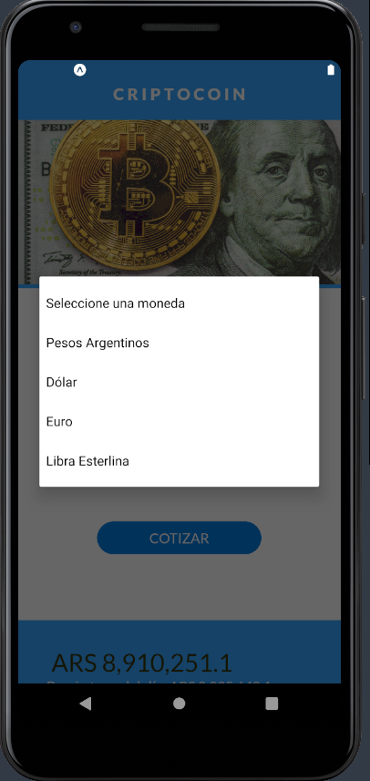
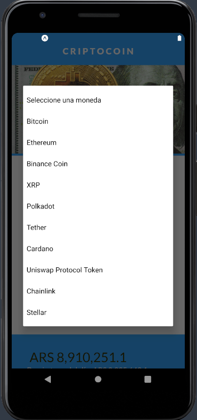

# criptocoin
Una aplicación para convertir divisas ( monedas a criptomonedas ) desarrollada en React Native

- Vista principal.
- Formulario.
- Spinner.
- Cotización.
- Conexión a API de crypto compare.

## Preview:

 
 
